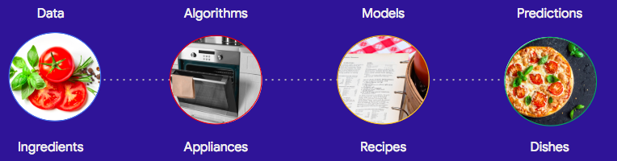

```{r setup, include=FALSE}
knitr::opts_chunk$set(echo = FALSE)
```


# Schedule

| Topic | Time |
| :---: | :---: |
| Introduction |  8:30 - 8:50 |
| Deep Learning Lecture | 8:50 - 10:00 |
| Break | 10:00 - 10:15 |
| Databricks account setup | 10:15 - 10:30 |
| Deep Learning Lecture | 10:30 - 11:30 |
| Deep Learning Hands on Session | 11:30 - 12:00 |
| Lunch break @ Gallery A-B | 12:00 - 13:00 |
| Deep Learning Hands on Session | 13:00 - 13:30 |
| Data Preprocessing & Wrangling | 13:30 - 14:30 |
| Big Data Cloud Platform Lecture | 14:30 - 15:10 |
| Break | 15:10 - 15:30 |
| Big Data Cloud Platform Hands on | 15:30 - 16:30 |
| Analytical dashboard and report | 16:30 - 17:00 |
| Soft Skill and Project Cycle | 17:00 - 17:30 |

# Slides 

<center>
<font size = "10">
https://github.com/happyrabbit/DataScienceWorkshop2018
</font>
</center>


# The term no one really defined

- What is data science?

> Data science is the discipline of making data useful.  Ok...so what is it? 


# What is a data scientist?

Here is a list of definitions for a “data scientist”:

- “A data scientist is a data analyst who lives in California”
- “A data scientist is someone who is better at statistics than any software engineer and better - at software engineering than any statistician.”
- “A data scientist is a statistician who lives in San Francisco.”
- “Data Science is statistics on a Mac.”

# What is data science?

{width=100%}

Credit to: [Why businesses fail at machine learning](https://hackernoon.com/why-businesses-fail-at-machine-learning-fbff41c4d5db)

# Different roles in data science

- Researchers: build cutting-edge appliances
- Decision-makers and product managers:  figure out what’s worth cooking / what the objectives are
- Domain experts and social scientists: understand the suppliers and the customers 
- Data engineer and analysts: process ingredients at scale 
- Applied ML engineers: try many different ingredient-appliance combinations quickly to generate potential recipes
- Statisticians: check that the quality of the recipe is good enough to serve 
- Software engineers: turn a potential recipe into millions of dishes served efficiently 
- Project/program managers: keep the interdisciplinary team on track
- Reliability engineers: ensure that your dishes stay top notch even if the delivery truck brings you a ton of potatoes instead of the rice you ordered 


# Types of Questions

- Comparison: 
    - Are males more inclined to buy our products than females?
    - Are there any differences in customer satisfaction in different business districts?
    - Do soybean carrying a particular gene have higher oil content?

- Description:
    - Is the distribution of annual income normal?
    - Are there outliers?
    - What are the means of different customer segments?

- Clustering:
    - Which customers have similar product preference? 
    - Which printer performs similar pattern to the broken ones?
    - How many different themes are there in the corpus?

# Types of Questions

- Classification:
    - Who is more likely to buy our product?
    -  Is the borrower going to pay back?
    -  Is it a spam?

- Regression:
    - What will be the temperature tomorrow?
    - What is the projected net income for the next season?
    - How much inventory should we have? 


# Types of Learning

- Supervised Learning
    - Input data labeled
    - Classification and regression

- Unsupervised Learning
    - Input data not labeled
    - Clustering

- Transfer Learning 

# Types of Algorithm (1)

- Regression
    - Ordinary Least Squares
    - Logistic Regression
    - Multivariate Adaptive Regression Splines (MARS)
    
- Instance-based Methods
    - k-Nearest Neighbour (kNN)
    
- Regularization Methods
    - Ridge Regression
    - LASSO
    - Elastic Net
    
- Decision Tree
    - Classification and Regression Tree (CART)
    - Bootstrapped Aggregation (Bagging)
    - Random Forest
    - Gradient Boosting Machines (GBM)
    
# Types of Algorithm (2)

- Bayesian
    - Naive Bayes
    - Bayesian Belief Network (BBN)
    
- Kernel Methods
    - Support Vector Machines (SVM)
    - Linear Discriminate Analysis (LDA)
    
- Association Rule Learning
    - Apriori algorithm
    - Eclat algorithm
    
# Types of Algorithm (3)


- Neural Network and Deep Learning
    - Feed Forward Neural Network (FFNN)
    - Convolutional Neural Network (CNN)
    - Recurrent Neural Network (RNN)
    
- Dimensionality Reduction
    - Principal Component Analysis (PCA)
    - Partial Least Squares Regression (PLS)
    - Multidimensional Scaling (MDS)


# Data Scientist Skill Set

{width=100%}


# General Process 

{width=100%}

# Automatic Data Science Pipeline

{width=100%}

# Some links

- [Industry recommendations for academic data science programs](https://github.com/brohrer/academic_advisory)

- [Awesome-Data-Science-Materials](https://github.com/happyrabbit/Awesome-Data-Science-Materials)

- Online books:
    - [The Elements of Statistical Learning](http://web.stanford.edu/~hastie/ElemStatLearn/)
    - [An Introduction to Statistical Learning](http://www-bcf.usc.edu/~gareth/ISL/)
    - [Introduction to Data Science](http://scientistcafe.com/IDS/)(still writing)

- Hard copy books:
    - [Applied Predictive Modeling](http://appliedpredictivemodeling.com)
    - [R for Marketing Research and Analytics](http://r-marketing.r-forge.r-project.org)

- [Big Data with R](https://www.dropbox.com/sh/8t4k8lgk0su3gjb/AAD4GwWUhUj7bdkmw0j7FPWNa/bigdataclass2018?dl=0)
