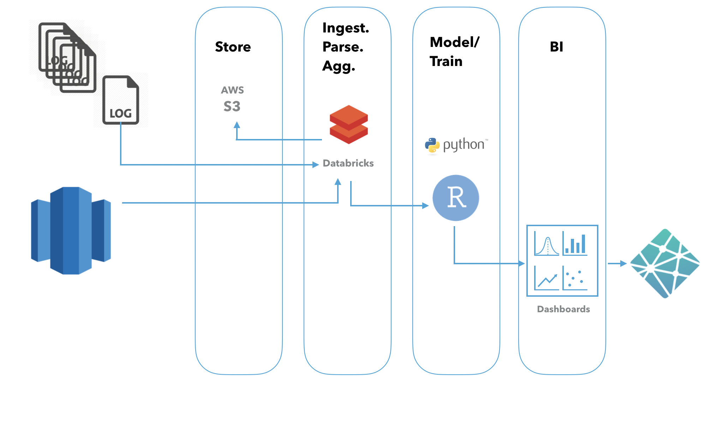

```{r setup, include=FALSE}
knitr::opts_chunk$set(echo = FALSE)
```

# Schedule

| Topic | Time |
| :---: | :---: |
| Introduction to Data Science | 08:40 - 09:10 | 
| Deep Learning 1 | 09:10 - 10:10 |
| Tea Break | 10:10 - 10:30 |
| Deep Learning 2 & 3 | 10:30 - 12:00 |
| Lunch | 12:00 - 13:00 |
| Big Data Cloud Platform and Hands-on | 13:00 - 13:45 |
| Deep Learning 1 Hands-on | 13:45 - 14:30 |
| Tea Break | 14:30 - 14:50 |
| Deep Learning 2 & 3 Hands-on | 14:50 - 15:50 |
| Soft Skill and Project Cycle | 15:50 - 16:15 |
| Q&A	| 16:15 - 16:30 | 


13:00-16:30 Afternoon shortcourse
14:30-14:50 Tea break

# Course Website

<center>
<font size = "10">
https://idad2019.netlify.com/
</font>
</center>

# The term no one really defined

- What is data science?

> Data science is the discipline of making data useful.  Ok...so what is it? 


#  What is “hard-core pornography”?

> Jacobellis v. Ohio, 378 U.S. 184 (1964), was a United States Supreme Court decision handed down in 1964 involving whether the state of Ohio could, consistent with the First Amendment, ban the showing of the Louis Malle film The Lovers (Les Amants), which the state had deemed obscene.

#  What is “hard-core pornography”?

- Obscenity case of Jacobellis v. Ohio (1964)

> “I know it when I see it.” (Justice Potter Stewart)

# Three tracks of data science

- Engineering: the process of making everything else possible

- Analysis: the process of turning raw information into insights in a fast way

- Modeling: the process of diving deeper into the data to discover the pattern we don't easily see


(It is a group work from https://github.com/brohrer/academic_advisory/blob/master/authors.md !)

# Engineering

(1) Data environment: data storage, Kafka platform, Hadoop and Spark cluster etc.

(2) Data management:  parsing the logs, web scraping, API queries, and interrogating data streams. 

(3) Production: integrate model and analysis into the production system

# Engineering - Production 

{width=70%}

# Data Pipeline

{width=80%}

# Analysis

(1) Domain knowledge

(2) Exploratory analysis

(3) Story telling

# Modeling

(1) Supervised learning

(2) Unsupervised learning

(3) Customized model development

# General Process of Modeling/Analytics

{width=100%}

# Three tracks of data science


# Three tracks of data science


# Three tracks of data science


# [Data Science Curriculum Roadmap](https://github.com/brohrer/academic_advisory/blob/master/curriculum_roadmap.md)


# What can (should) data science do?

> - Make human better human by alleviating bounded rationality and minimize politics/emotion (rather than make machine more like human)

> - Strive for the “democratization” of data as legally possible: empower everyone in the organization to acquire, process, and leverage data in a timely and efficient fashion

# Data Science Hierarchy of Needs


# Data Science Types v.s Needs


# Data Science Types v.s Needs


# Data Science Types v.s Needs


# Data Science Types v.s Needs


# Types of Questions (Modeling/Analytics)

- Comparison: 
    - Are males more inclined to buy our products than females?
    - Are there any differences in customer satisfaction in different business districts?
    - Do soybean carrying a particular gene have higher oil content?

- Description:
    - Is the distribution of annual income normal?
    - Are there outliers?
    - What are the means of different customer segments?

- Clustering:
    - Which customers have similar product preference? 
    - Which printer performs similar pattern to the broken ones?
    - How many different themes are there in the corpus?

# Types of Questions (Modeling/Analytics)

- Classification:
    - Who is more likely to buy our product?
    - Is the borrower going to pay back?
    - Is it a spam?

- Regression:
    - What will be the temperature tomorrow?
    - What is the projected net income for the next season?
    - How much inventory should we have? 

# Where does data science belong in your organization?

<center>**A standalone team** </center>

- An autonomous unit parallel to engineering
- A strategic differentiator for the organization
- The head of data science unit should ideally report into the CEO or at least report into someone who understands data strategy and is willing to invest to give it what it needs. 
- Pros: 
    - autonomy
    - well positioned to tackle whatever problems it deems most valuable 
    - knowledge share and grow
    - attract/retain talent
- Cons: risk of marginalization

# Where does data science belong in your organization?

<center>**An embedded model**</center>

- Bring in talented people and farms them out to the rest of the company. There’s still a head of data science, but he/she is mostly a hiring manager and coach.
- Give up autonomy to ensure utility
- Pros: 
    - closer to applications
    - flexibility
- Cons: 
    - hard to attract/retain talent 
    - their embedded team leads don’t feel responsible for their growth and happiness, while their managers won’t feel directly vested in their work
    - data scientists are second-class citizens everywhere

# Where does data science belong in your organization?

<center>**Integrated team**</center>

- No separate data science team; each team hires and manages its own data scientists.
- Pros: 
    - optimizes for organizational alignment; 
- Cons: 
    - dilutes the identity of data science; 
    - hurt data scientist's career growth; 
    - sacrifice the flexibility of the embedded model


# Some links

- The deep learning slides are based on Andrew Ng's course: [Deep Learning Specialization](https://www.coursera.org/specializations/deep-learning): Super awesome!

- [Industry recommendations for academic data science programs](https://github.com/brohrer/academic_advisory)

- [Awesome-Data-Science-Materials](https://github.com/happyrabbit/Awesome-Data-Science-Materials)

- Online books:
    - [The Elements of Statistical Learning](http://web.stanford.edu/~hastie/ElemStatLearn/)
    - [An Introduction to Statistical Learning](http://www-bcf.usc.edu/~gareth/ISL/)
    - [Introduction to Data Science](http://scientistcafe.com/IDS/)(still writing)

- Hard copy books:
    - [Applied Predictive Modeling](http://appliedpredictivemodeling.com)
    - [R for Marketing Research and Analytics](http://r-marketing.r-forge.r-project.org)


