```{r setup, include=FALSE}
knitr::opts_chunk$set(echo = FALSE)
```

# Types of Neural Network 

<center>
{width=80%}
</center>

# Computer Vision

- Image Classification

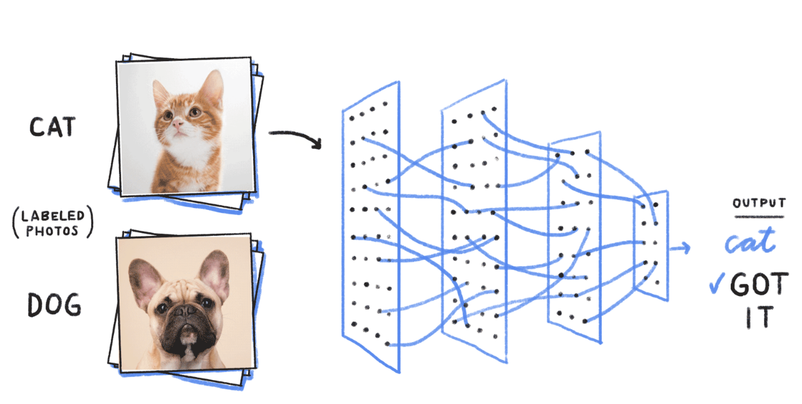{width=60%}

# Computer Vision

- Object Detection

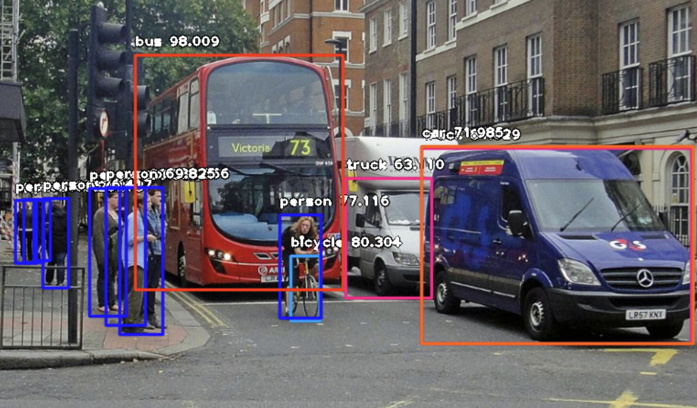{width=60%}

# Computer Vision

- Neural Style Transfer

{width=60%}

# Is it math?

{width=60%}

# Image Data

<center>
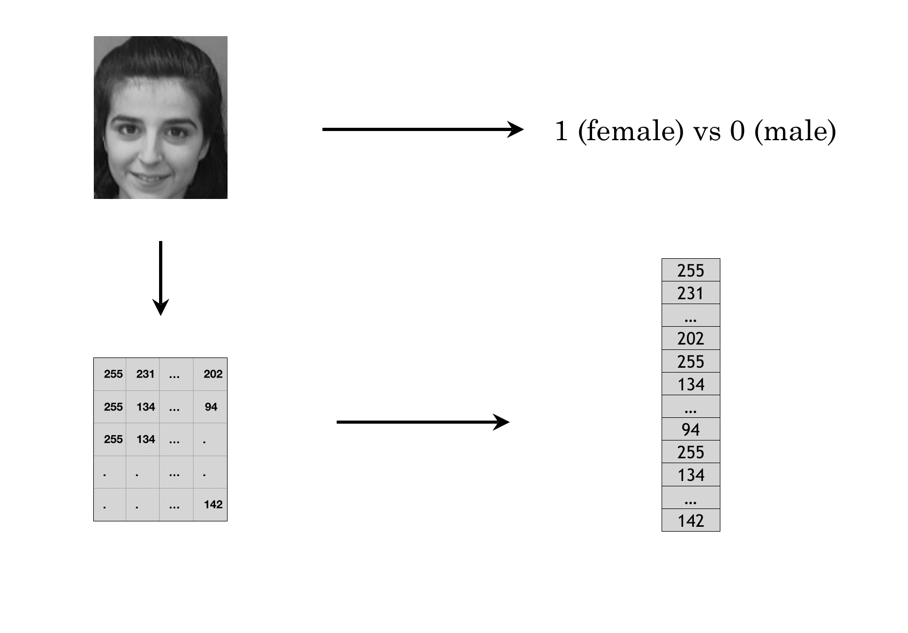{width=80%}
</center>

# Image Data

<center>
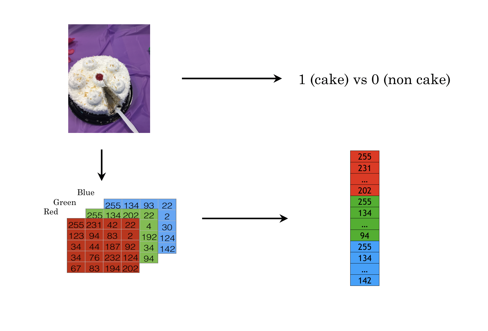{width=80%}
</center>

# Convolutions Schematic

<center>
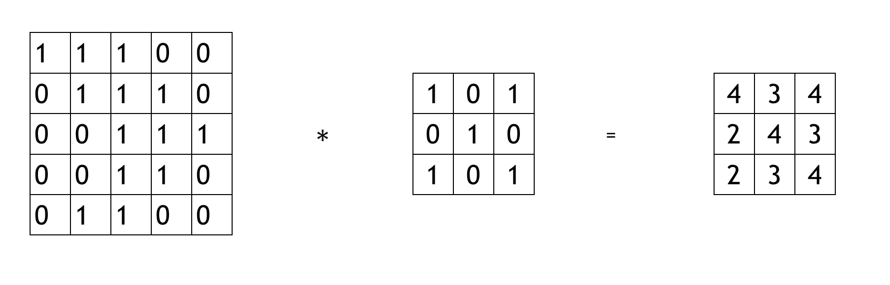{width=60%}
</center>

<center>
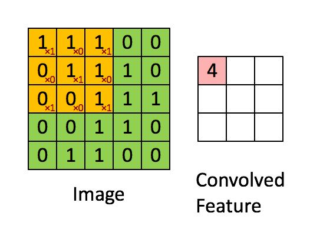
</center>

# Edge Detection

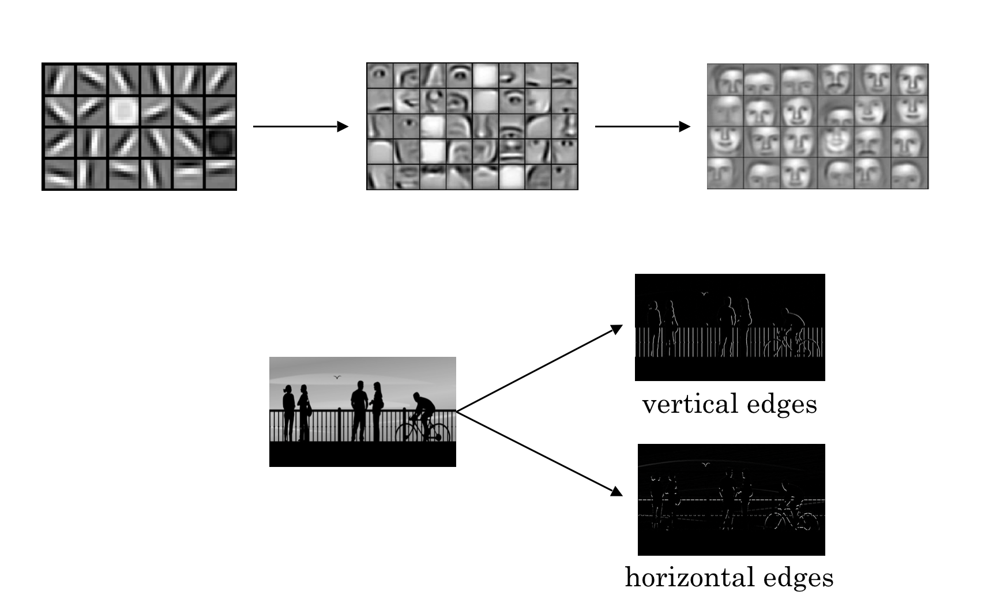{width=60%}

# Vertical Edge Detection

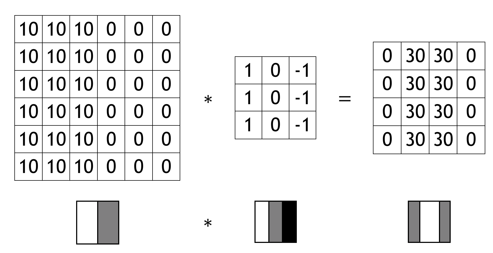{width=60%}

# Parameters

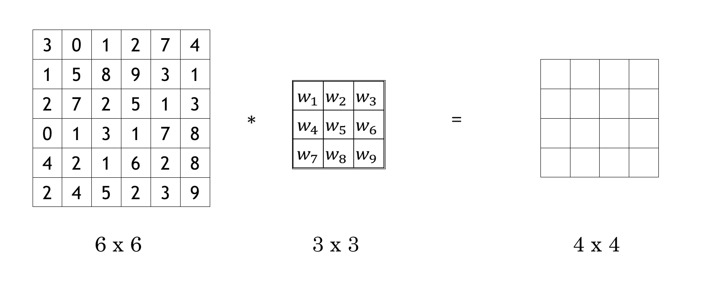{width=60%}

# Padding

- Pad so that output size is the same as the input size.

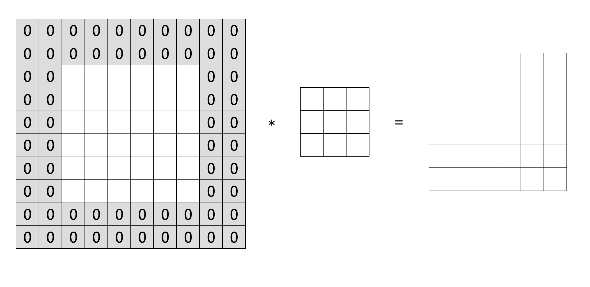{width=60%}

# Strided convolutions

- $n\times n$ ($n=7$) 
- $f \times f$ ($f=3$)
- no padding
- stride $s=2$

{width=60%}

# Summary of Convolutions

- $n \times n$ image; $f \times f$ filter 
- padding $p$;  stride $s$ 
- Output: $\left[ \frac{n+2p-f}{s}+1 \right] \times \left[ \frac{n+2p-f}{s} +1 \right]$

# Convolutions Over Volume

{width=100%}

- https://www.youtube.com/watch?v=HzuFgLnhgqw

# Your Turn: Number of Parameters in One Layer

> Question: If you have 10 filters that are $3 \times 3 \times 3$ in one layer of a neural network, how many parameters does that layer have?

# Summary of Notation

If layer $l$ is a convolution layer:

- $f^{[l]}$ = filter size
- $p^{[l]}$ = padding
- $s^{[l]}$ = stride
- $n^{[l]}_C$ = number of filters
- Each filter: $f^{[l]} \times f^{[l]} \times n^{[l-1]}_C$
- Activations: $a^{[l]} \rightarrow n_H^{[l]} \times n_W^{[l]} \times n_C^{[l]}$
- Weights: $f^{[l]} \times f^{[l]} \times  n^{[l-1]}_C \times  n^{[l]}_C$
- bias: $b^{[l]}_C$
- Input:  $n^{[l-1]}_H \times  n^{[l-1]}_W \times  n^{[l-1]}_C$
- Output: $n^{[l]}_H \times  n^{[l]}_W \times  n^{[l]}_C$
- $n^{[l]}_H = \frac{n^{[l-1]}_W + 2p^{[l]}-f^{[l]}}{s^{[l]}}+1$ (similar for $W$)

# Pooling Layers

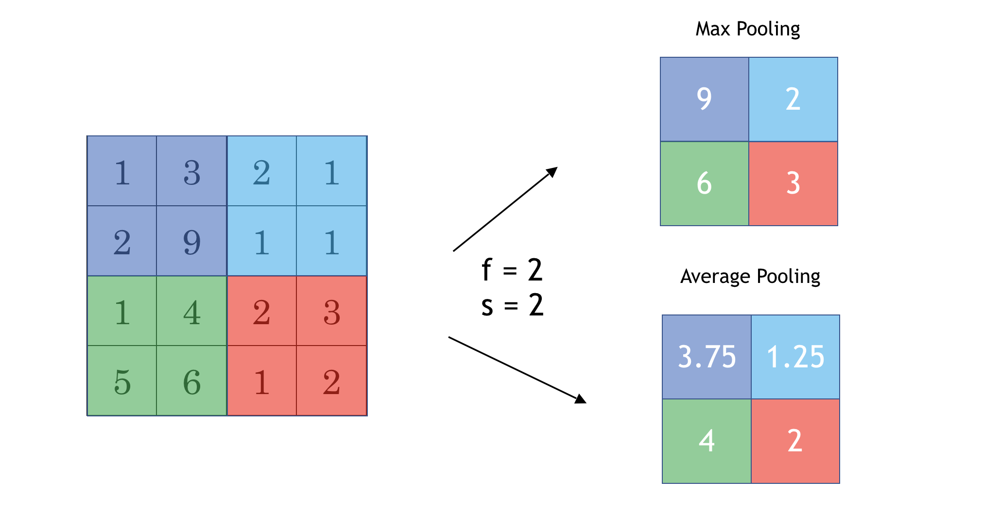{width=90%}


# Examples: LeNet - 5

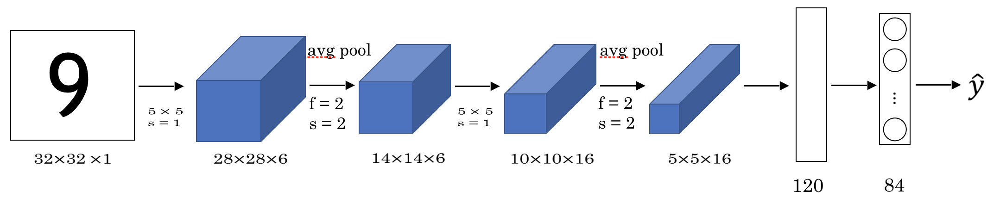{width=90%}

# Examples: LeNet - 5

|  | Activation Shape |   Activation Size | # Parameters |
|:---:|:---:|:---:|:---:|
| Input | (32, 32, 1) | 1024 | 0|
| CONV1 (f=5, s=1) | (28, 28, 6) | 6272 | $5 \times 5 \times 6 + 6 = 156$ |
| POOL1 (f=2, s=2) | (14, 14, 6) | 1176 | 0 |
| CONV2 (f=5, s=1) | (10, 10, 16) | 1600 | $5 \times 5 \times 6 \times 16 + 16 = 2416$ |
| POOL2 (f=2, s=2) | (5, 5, 16) | 1176 | 0 |
| FC3 | (120, 1) | 120 | $400 \times 120 + 1 = 48001$ |
| FC4 | (84, 1) | 84 | $120 \times 84 + 1 = 10081$ |
| Softmax | (10, 1) | 10 | $84 \times 10 +1 = 841$ |

# Types of Layer in A Convolutional Network

- Convolution

- Pooling

- Fully Connected

# Using Keras To Build CNN

Typical `keras` workflow:

1. Define your training data: input tensors and target tensors
2. Define a network of layers (or models) that maps your inputs to your targets
3. Configure the learning process by choosing a loss function, an optimizer, and some metrics to monitor
4. Iterate on your training data by calling the `fit()` method of your model

# Using Keras To Build CNN

```r
# Define model structure
cnn_model <- keras_model_sequential() %>%
  layer_conv_2d(filters = 32, kernel_size = c(3, 3), 
  activation = "relu", input_shape = input_shape) %>%
  layer_max_pooling_2d(pool_size = c(2, 2)) %>%
  layer_conv_2d(filters = 64, kernel_size = c(3, 3), activation = "relu") %>%
  layer_dropout(rate = 0.25) %>%
  layer_flatten() %>%
  layer_dense(units = 128, activation = "relu") %>%
  layer_dropout(rate = 0.5) %>%
  layer_dense(units = num_classes, activation = "softmax")
```

# Using Keras To Build CNN

- Compile and define loss function, optimizer and metrics to monitor during the training

```r
# Compile model
cnn_model %>% compile(
  loss = loss_categorical_crossentropy,
  optimizer = optimizer_adadelta(),
  metrics = c('accuracy')
)
```

# Using Keras To Build CNN

- Fit the model using training dataset and define epochs, batch size and validation data

```r
# Train model
cnn_history <- cnn_model %>%
  fit(
    x_train, y_train,
    batch_size = batch_size,
    epochs = epochs,
    validation_split = 0.2
  )
```

- Predict new outcomes using the trained model

```r
# Model prediction
cnn_pred <- cnn_model %>%
  predict_classes(x_test)
```

# Size of the Model

{width=90%}


# Effective CNNs

- LeNet -5:  LeCun et al., 1998. [Gradient-based learning applied to document recognition](http://yann.lecun.com/exdb/publis/pdf/lecun-01a.pdf)

- AlexNet: Krizhevsky et al., 2012. [ImageNet Classification with Deep Convolutional Neural Networks](https://papers.nips.cc/paper/4824-imagenet-classification-with-deep-convolutional-neural-networks.pdf)

- VGG-16: Simonyan & Zisserman 2015. [Very Deep Convolutional Networks for Large-Scale Image Recognition](https://arxiv.org/pdf/1409.1556.pdf)

- ResNets: He et al., 2015. [Deep Residual Learning for Image Recognition](https://arxiv.org/abs/1512.03385)

# Different Architecture Search Algorithms:

- [NASnet](https://arxiv.org/pdf/1611.01578.pdf): 1800 GPU days (5 yrs on 1 GPU)

- [AmoebaNet](https://arxiv.org/pdf/1802.01548.pdf): 3150 GPU days

- [DARTS](https://arxiv.org/pdf/1806.09055.pdf): 4 GPU days

- [ENAS](https://arxiv.org/pdf/1802.03268.pdf):  1000 x cheaper than standard NAS

# Understanding Neural Networks

- [Understanding Neural Networks Through Deep Visualization](http://yosinski.com/deepvis), [Video](http://yosinski.com/deepvis#toolbox)

- [Deep Neural Networks are Easily Fooled](http://anhnguyen.me/project/fooling/), [Video](https://www.youtube.com/watch?v=M2IebCN9Ht4&feature=youtu.be)
