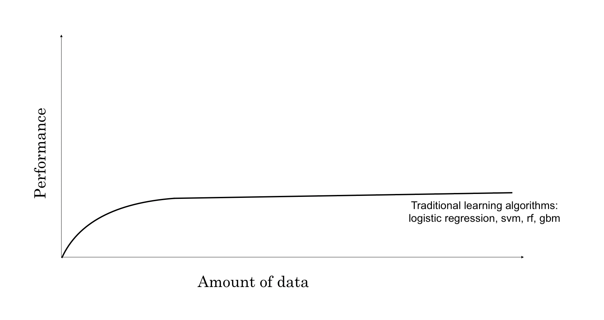
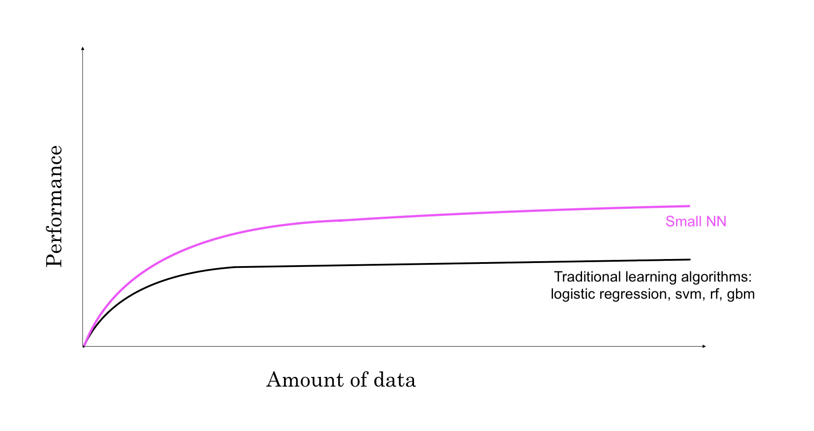
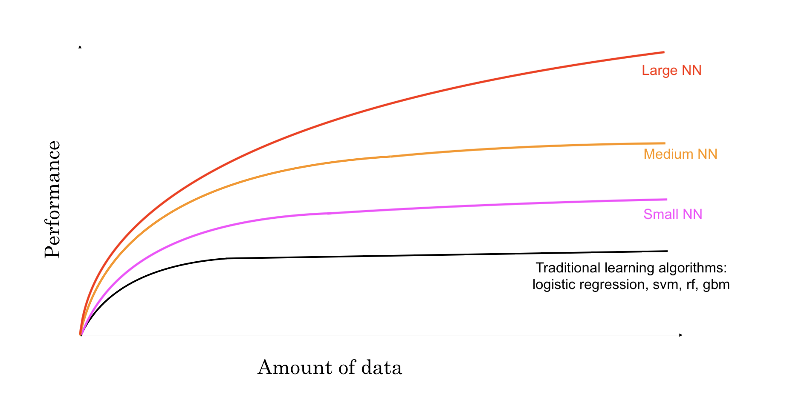
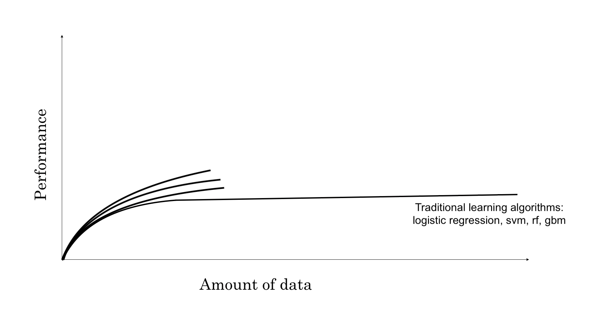

```{r setup, include=FALSE}
knitr::opts_chunk$set(echo = FALSE)
```

# Types of Neural Network 

<center>
{width=80%}
</center>

# Neural Network Application

| Input (x) | Output (y) | Application |
| :---: |  :---:  |  :---: |
| **Home features** | **Price** | **Real Estate** |
| **Ad, user info** | **Click on an Ad? (0/1)** | **Online Advertising** |
| Image | Object (1, ..., 10) | Photo tagging |
| Image, Radar info | Position of other cars | Autonomous driving |
| Audio | Text transcript | Speech recognition |
| English | Chinese | Machine translation |
| Voice  | Voice | Human computer conversation |

# Why is deep learning taking off?

- Scale, scale, scale

{width=90%}

# Why is deep learning taking off?

{width=90%}

# Why is deep learning taking off?

{width=90%}

# Why is deep learning taking off?

{width=90%}

# Why is deep learning taking off?

{width=90%}

# Why is deep learning taking off?

{width=90%}

# Logistic Regression as a Neural Network

- m training samples: $\{(x^{(1)}, y^{(1)}),(x^{(2)}, y^{(2)}),...,(x^{(m)}, y^{(m)})\}$

$$X=\left[\begin{array}{cccc}
x_{1}^{(1)} & x_{1}^{(2)} & \dotsb & x_{1}^{(m)}\\
x_{2}^{(1)} & x_{2}^{(2)} & \dotsb & x_{2}^{(m)}\\
\vdots & \vdots & \vdots & \vdots\\
x_{n_{x}}^{(1)} & x_{n_{x}}^{(2)} & \dots & x_{n_{x}}^{(m)}
\end{array}\right]\in\mathbb{R}^{n_{x}\times m}$$

$$y=[y^{(1)},y^{(2)},\dots,y^{(m)}] \in \mathbb{R}^{1 \times m}$$

$\hat{y}^{(i)} = \sigma(w^Tx^{(i)} + b)$ where $\sigma(z) = \frac{1}{1+e^{-z}}$


# Logistic Regression as a Neural Network

- m training samples: $\{(x^{(1)}, y^{(1)}),(x^{(2)}, y^{(2)}),...,(x^{(m)}, y^{(m)})\}$

$$X=\left[\begin{array}{cccc}
x_{1}^{(1)} & x_{1}^{(2)} & \dotsb & x_{1}^{(m)}\\
x_{2}^{(1)} & x_{2}^{(2)} & \dotsb & x_{2}^{(m)}\\
\vdots & \vdots & \vdots & \vdots\\
x_{n_{x}}^{(1)} & x_{n_{x}}^{(2)} & \dots & x_{n_{x}}^{(m)}
\end{array}\right]\in\mathbb{R}^{n_{x}\times m}$$

$$y=[y^{(1)},y^{(2)},\dots,y^{(m)}] \in \mathbb{R}^{1 \times m}$$

$\hat{y}^{(i)} = \sigma(w^Tx^{(i)} + b)$ where $\sigma(z) = \frac{1}{1+e^{-z}}$

- Loss function: $L(\hat{y},y) = -ylog(\hat{y})-(1-y)log(1-\hat{y})$
- Cost function: $J(w,b)=\frac{1}{m} \Sigma_{i=1}^m L(\hat{y}^{(i)}, y^{(i)}) = \frac{1}{m} \Sigma_{i=1}^{m} \{\ -y^{(i)}log(\hat{y}^{(i)})-(1-y^{(i)})log(1-\hat{y}^{(i)}) \}$
- Goal: Find $w,b$ that mininizes $J(w,b)$
    - $w := w - \alpha \frac{\partial J}{\partial w}$
    - $b := b - \alpha \frac{\partial J}{\partial b}$

# Neural Network:  0 layer neural network

<center>
{width=60%}
</center>

# Neural Network: 1 layer neural network

<center>
{width=60%}
</center>

# Neural Network: 1 layer neural network

<center>
{width=80%}
</center>

# Neural Network: 1 layer neural network

<center>
{width=80%}
</center>

# Neural Network: 1 layer neural network

<center>
{width=80%}
</center>

# Across m samples

# Activation functions

# Back Propogation