```{r setup, include=FALSE}
knitr::opts_chunk$set(echo = FALSE)
```

# Types of Neural Network 

<center>
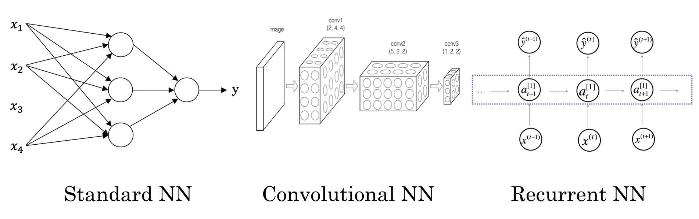{width=80%}
</center>

# Neural Network Application

| Input (x) | Output (y) | Application |
| :---: |  :---:  |  :---: |
| Home features | Price | Real Estate |
| Ad, user info | Click on an Ad? (0/1) | Online Advertising |
| Image | Object (1, ..., 10) | Photo tagging |
| Image, Radar info | Position of other cars | Autonomous driving |
| Audio | Text transcript | Speech recognition |
| English | Chinese | Machine translation |
| Voice  | Voice | Human computer conversation |


# Logistic Regression as A Neural Network

- m training samples: $\{(x^{(1)}, y^{(1)}),(x^{(2)}, y^{(2)}),...,(x^{(m)}, y^{(m)})\}$

$$X=\left[\begin{array}{cccc}
x_{1}^{(1)} & x_{1}^{(2)} & \dotsb & x_{1}^{(m)}\\
x_{2}^{(1)} & x_{2}^{(2)} & \dotsb & x_{2}^{(m)}\\
\vdots & \vdots & \vdots & \vdots\\
x_{n_{x}}^{(1)} & x_{n_{x}}^{(2)} & \dots & x_{n_{x}}^{(m)}
\end{array}\right]\in\mathbb{R}^{n_{x}\times m}$$

$$y=[y^{(1)},y^{(2)},\dots,y^{(m)}] \in \mathbb{R}^{1 \times m}$$

$\hat{y}^{(i)} = \sigma(w^Tx^{(i)} + b)$ where $\sigma(z) = \frac{1}{1+e^{-z}}$


# Logistic Regression as A Neural Network

- m training samples: $\{(x^{(1)}, y^{(1)}),(x^{(2)}, y^{(2)}),...,(x^{(m)}, y^{(m)})\}$

$$X=\left[\begin{array}{cccc}
x_{1}^{(1)} & x_{1}^{(2)} & \dotsb & x_{1}^{(m)}\\
x_{2}^{(1)} & x_{2}^{(2)} & \dotsb & x_{2}^{(m)}\\
\vdots & \vdots & \vdots & \vdots\\
x_{n_{x}}^{(1)} & x_{n_{x}}^{(2)} & \dots & x_{n_{x}}^{(m)}
\end{array}\right]\in\mathbb{R}^{n_{x}\times m}$$

$$y=[y^{(1)},y^{(2)},\dots,y^{(m)}] \in \mathbb{R}^{1 \times m}$$

$\hat{y}^{(i)} = \sigma(w^Tx^{(i)} + b)$ where $\sigma(z) = \frac{1}{1+e^{-z}}$

- Loss function: $L(\hat{y},y) = -ylog(\hat{y})-(1-y)log(1-\hat{y})$
- Cost function: $J(w,b)=\frac{1}{m} \Sigma_{i=1}^m L(\hat{y}^{(i)}, y^{(i)}) = \frac{1}{m} \Sigma_{i=1}^{m} \{\ -y^{(i)}log(\hat{y}^{(i)})-(1-y^{(i)})log(1-\hat{y}^{(i)}) \}$
- Goal: Find $w,b$ that mininizes $J(w,b)$
    - $w := w - \alpha \frac{\partial J}{\partial w}$
    - $b := b - \alpha \frac{\partial J}{\partial b}$

# Gradient Descent

{width=90%}

# Neural Network:  0 Layer Neural Network

<center>
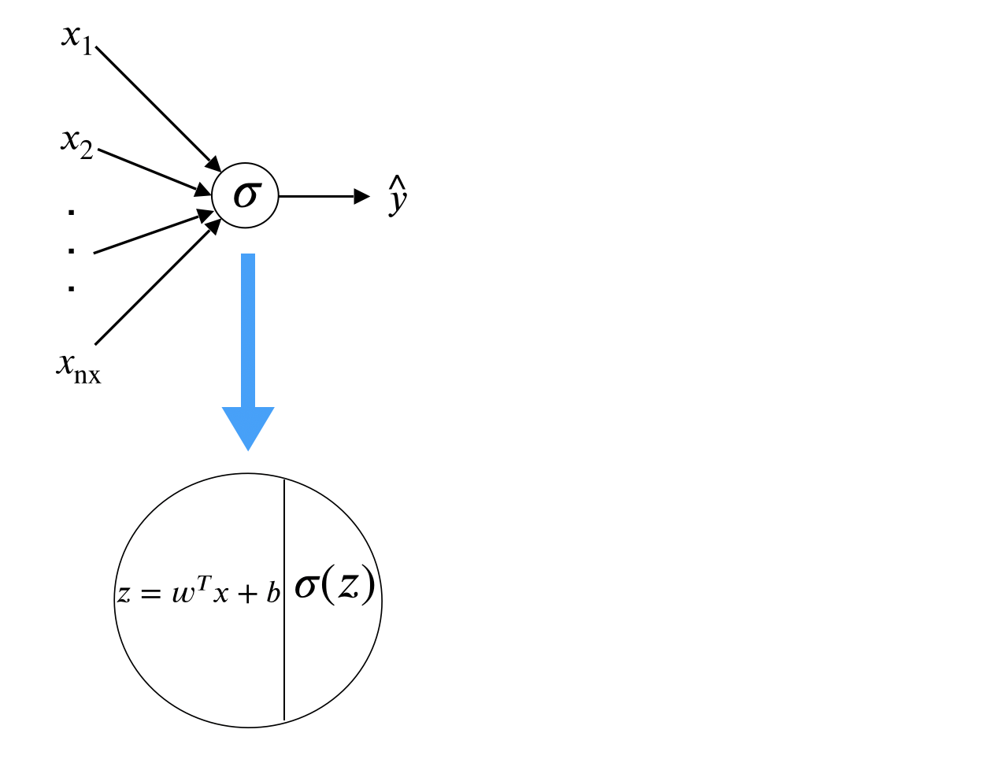{width=60%}
</center>

# Neural Network: 1 Layer Neural Network

<center>
{width=60%}
</center>

# Deep Neural Network

<center>
{width=80%}
</center>

# Neural Network: 1 Layer Neural Network

<center>
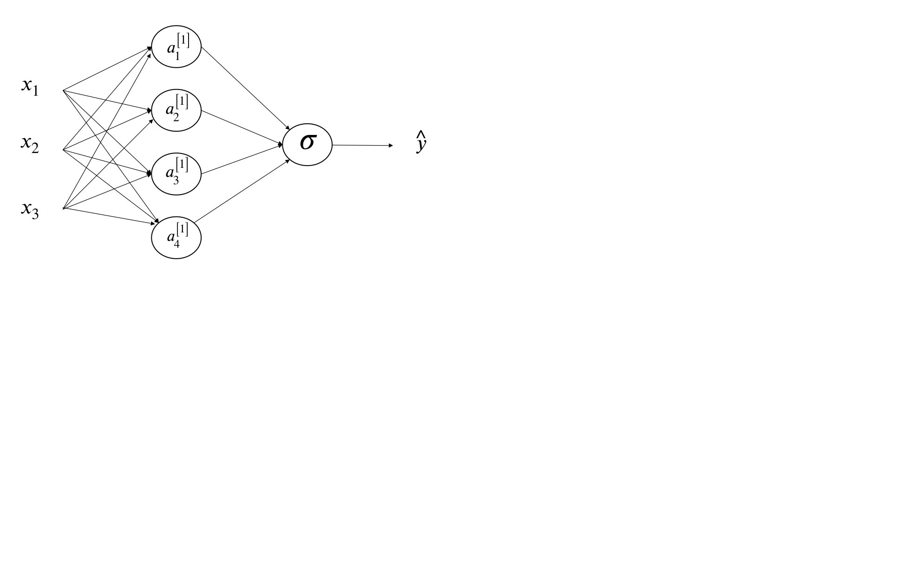{width=80%}
</center>

# Neural Network: 1 Layer Neural Network

<center>
{width=80%}
</center>

# Neural Network: 1 Layer Neural Network

<center>
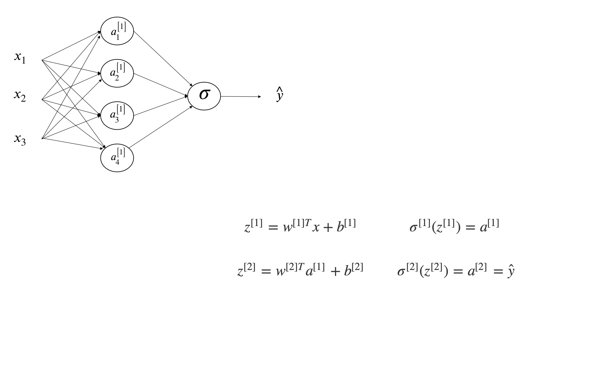{width=80%}
</center>

# Across m Samples

<center>
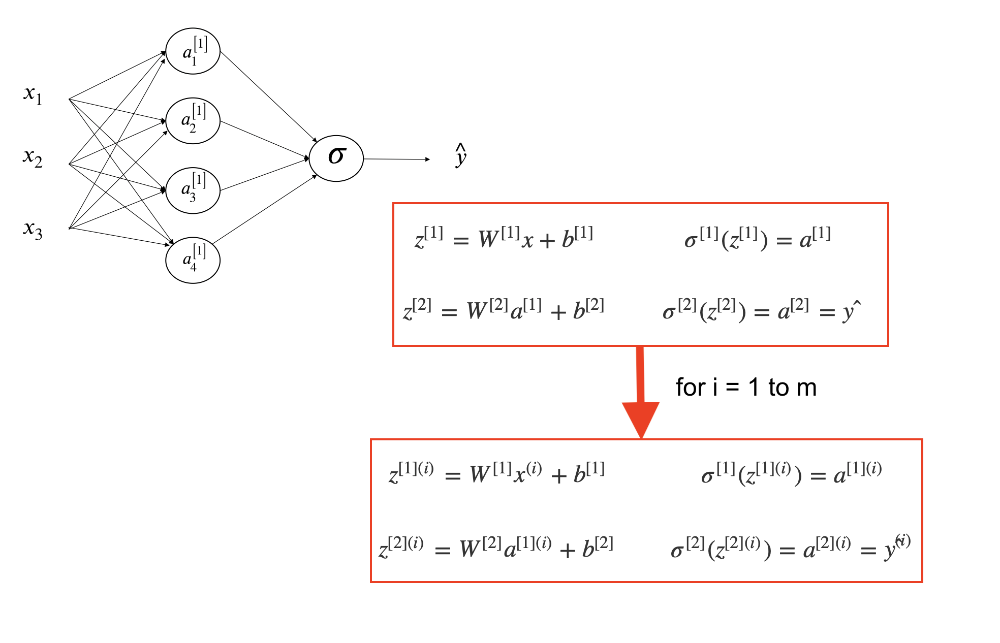{width=80%}
</center>

# Across m Samples

<center>
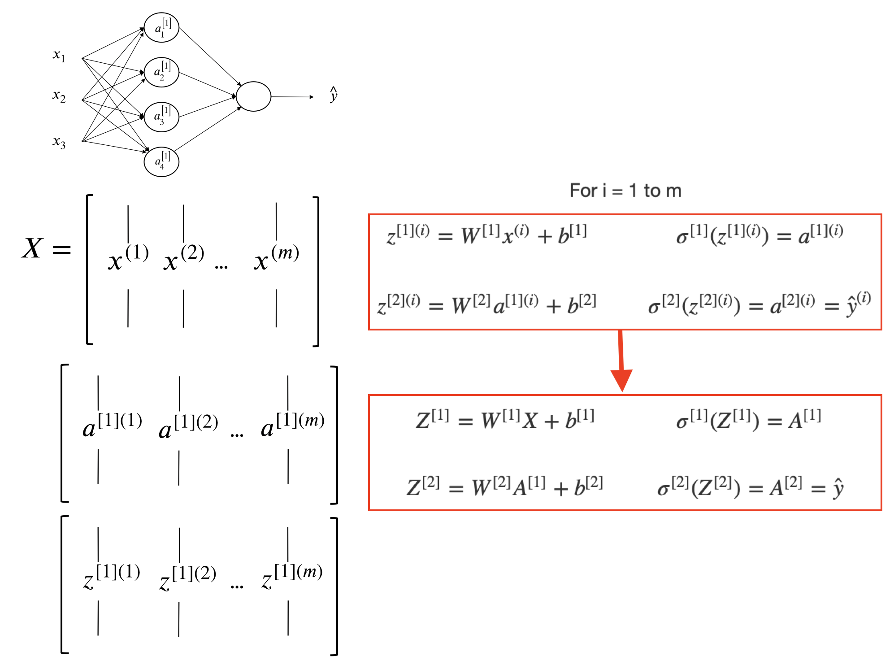{width=80%}
</center>

# Activation Functions

<center>
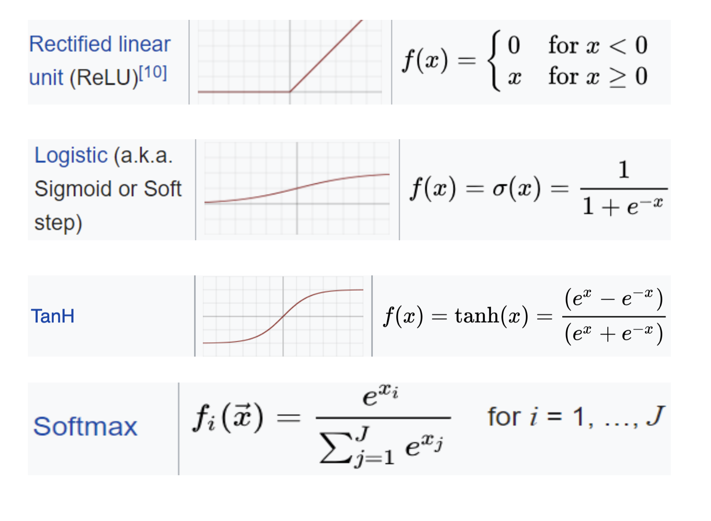{width=80%}
</center>

# Activation Functions

- Intermediate layers
    - Relu (i.e. rectified linear unit) is usually a good choice which has the following good properties:   
(1) fast computation;   
(2) non-linear;  
(3) reduced likelihood of the gradient to vanish;   
(4) Unconstrained response
    - Sigmoid, studied in the past, not as good as Relu in deep learning, due to the gradient vanishing problem when there are many layers
    - hyperbolic tangent function (tanh)

- Last layer which connects to the output
    - Binary classification: sigmoid with binary cross entropy as loss function
    - Multiple class, single-label classification: softmax with categorical cross entropy for loss function
    - Continuous responses: identity function (i.e. y = x)

# Deal with Overfitting: Regularization

For logistic regression,

$$\underset{w,b}{min}J(w,b)= \frac{1}{m} \Sigma_{i=1}^{m}L(\hat{y}^{(i)}, y^{(i)}) + penalty$$

where 

$$L_2\ penalty=\frac{\lambda}{2m}\parallel w \parallel_2^2 = \frac{\lambda}{2m}\Sigma_{i=1}^{n_x}w_i^2$$
$$L_1\ penalty = \frac{\lambda}{m}\Sigma_{i=1}^{n_x}|w|$$
For neural network,

$$J(w^{[1]},b^{[1]},\dots,w^{[L]},b^{[L]})=\frac{1}{m}\Sigma_{i=1}^{m}L(\hat{y}^{(i)},y^{(i)}) + \frac{\lambda}{2m}\Sigma_{l=1}^{L} \parallel w^{[l]} \parallel^2_F$$
where $\parallel w^{[l]} \parallel^2_F = \Sigma_{i=1}^{l}\Sigma_{j=1}^{l-1} (w^{[l]}_{ij})^2$

# Deal with Overfitting: Dropout

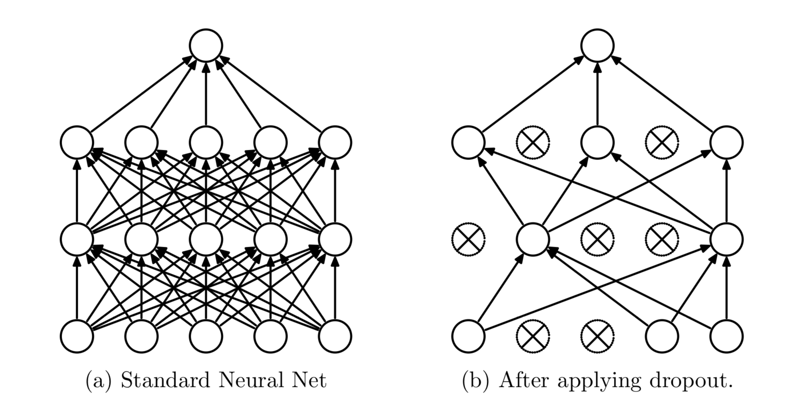{width=90%}

# Deal with Overfitting

- Huge number of parameters, even with large amount of training data, there is a potential of overfitting 
    - Overfitting due to size of the NN (i.e. total number of parameters)
    - Overfitting due to using the training data for too many epochs

- Solution for overfitting due to NN size
    - Dropout: randomly dropout some proportion (such as 0.3 or 0.5) of nodes at each layer, which is similar to random forest concept 
    - Using L1 or L2 regularization in the activation function at each layer 

- Solution for overfitting due to using too many epochs
    - Run NN with large number of epochs to reach overfitting region through cross validation from training/validation vs. epoch curve
    - Choose the model with number of epochs that have the minimum validation accuracy as the final NN model
    - The optimal number for epoch is determined by when the model is not overfitted (i.e. validation accuracy reaches the best performance)

# Is it overfitting?

{width=70%}

# Optimization Methods

- Mini-batch Stochastic Gradient Descent (SGD)
    - Use a small segment of data (i.e. 128 or 256) to update the SGD parameters (with hyper parameters)
    - Gradients are efficiently calculated using backpropagation method
    - When the entire dataset are used to updated the SGD, it is called one epoch and multiple epochs are needed to run to reach convergence
    - An updated version with "momentum" for quick convergence
    
# Recap of A Few Key Concepts

- **Data**: Require large well-labeled dataset
- **Computation**: intensive matrix-matrix operation
- **Structure** of fully connected feedforward NN
    - Size of the NN: total number of parameters
    - Depth: total number of layers (this is where deep learning comes from)
    - Width of a particular layer: number of nodes (i.e. neurons) in that layer
- **Activation function**
    - Intermediate layers
    - Last layer connecting to outputs
- **Loss function**
    - Classification (i.e. categorical response)
    - Regression (i.e. continuous response)
- **Optimization methods (SGD)**
    - Batch size
    - Learning rate 
    - Epoch
- **Deal with overfitting**
    - Dropout 
    - Regularization (L1 or L2)

# MNIST Dataset

- Contains 70000 handwritten labeled digit images with label (60000 training + 10000 testing)
- Census Bureau employees and American high school students wrote these digits
- Each image is 28x28 pixel in greyscale
- Yann LeCun used convolutional network LeNet to achieve < 1% error rate at 1990s

<center>
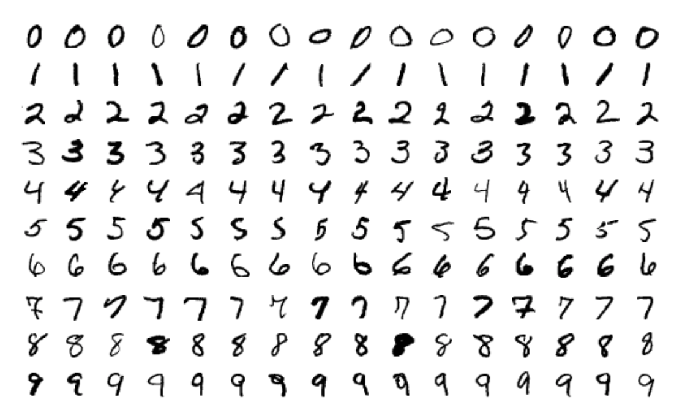{width=50%}
</center>

# Use Keras R Package

1. Data preprocessing (from image to list of input features)
    - One image of 28x28 grey scale value matrix $\rightarrow$ 784 column of features
    - Scale the value to between 0 and 1, by divide each value by 255
    - Make response categorical (i.e. 10 columns with the corresponding digit column 1 and rest columns zero.
    
2. Load keras package and build a neural network with a few layers
    - Define a placeholder object for the NN structure
    - 1st layer using 256 nodes, fully connected, using ‘relu’ activation function and connect from the input 784 features
    - 2nd layer using 128 nodes, fully connected, using ‘relu’ activation function
    - 3rd layer using 64 nodes, fully connected, using ‘relu’ activation function
    - 4th layer using 10 nodes, fully connected, using ‘softmax’ activation function and connect to the output 10 columns
    - Add drop out to the first three layers to prevent overfitting

3. Compile the NN model, define loss function, optimizer, and metrics to follow

4. Fit the NN model using the training dataset, define epoch, mini batch size, and validation size used in the training where the metrics will be checked

5. Predict using the fitted NN model using the testing dataset

# R Scripts

<center>
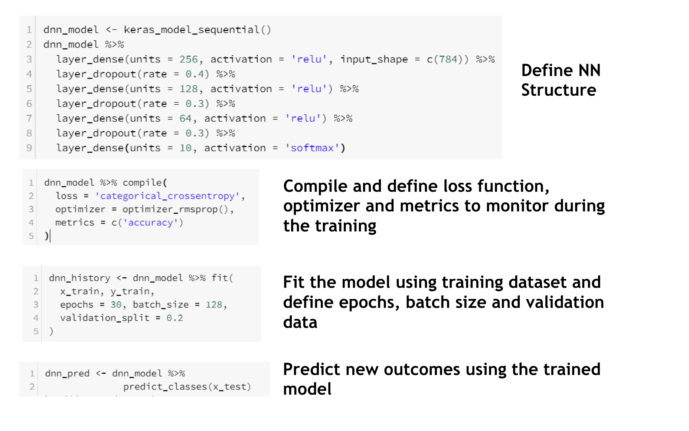{width=80%}
</center>

# Deep Learning Models Across Platforms

- Open NN Exchange Format (ONNX) (https://github.com/onnx/onnx )

<center>
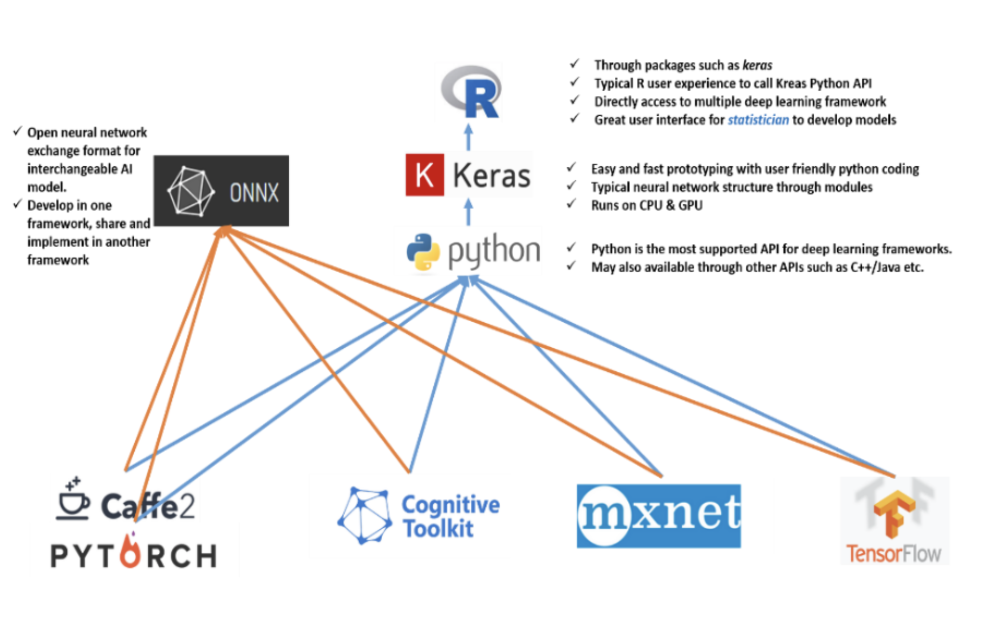{width=80%}
</center>


