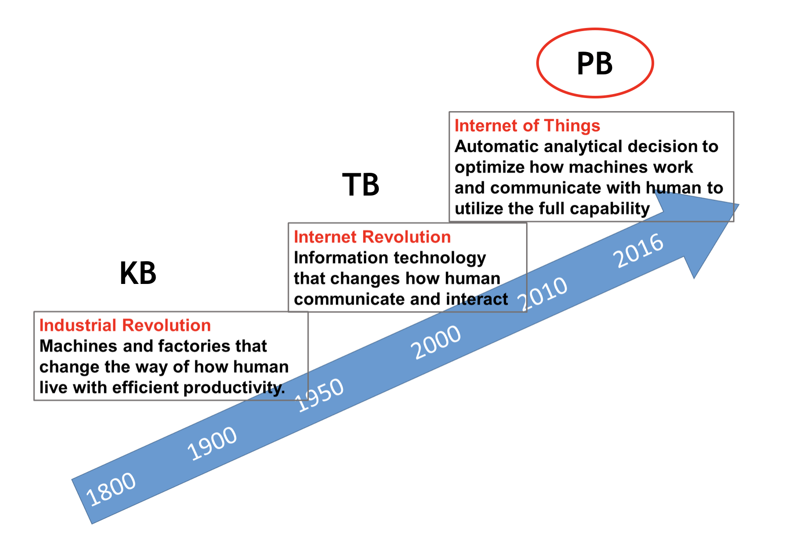
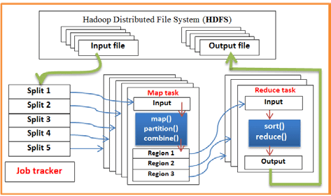

```{r setup, include=FALSE}
knitr::opts_chunk$set(echo = FALSE)
```

# The New Norm

<center>
{width=80%}
</center>

# Some Statistics

- 1 Gitabyte(GB) = 1024 Megabytes(MB) 
- 1 Petabyte(PB) = 1024 Terabytes(TB) 
- 1 Exabyte(EB) = 1024 Petabyte(PB) 
- PC holds 500 GB
- Netlify
    - 35 GB logs/day (1TB/month, 12TB/year, get to PB in 4 years)
    - 10 millions sites on our platform
- Google ([live statistics](http://www.internetlivestats.com/google-search-statistics/))
    - over 40,000 search queries/second; over 3.5 billion searches/day; 1.2 trillion searches/year(2012) 
    - 10-15 EB (data of 30 Million PCs combined!)
    - "Google currently processes over 20 petabytes of data per day through an average of 100,000 MapReduce jobs spread across its massive computing clusters."[(from a 2017 article)](https://www.heshmore.com/how-much-data-does-google-handle/)
 
# Move to the Cloud

- Amazon AWS cloud environment
- Microsoft Azure cloud environment
- Google cloud platform

<center>

</center>

# Hadoop/MapReduce/Spark

- HDFS (Hadoop Distributed File System)
    - Cut data into small segments (i.e. 64MB) as blocks
    - Duplicate each data block N times (i.e. N=3) and save them across computation nodes in the cluster
    - Master node saves all the data mapping information (i.e. meta data)
    - Data nodes save actual data blocks
    - When a few data nodes are down, data is still safe

- Hive and Pig: application software for easy access the data stored in HDFS and apply analytics

# Hadoop/MapReduce/Spark [^1]

<center>
{width=80%}
</center>

[^1]: Al-Barznji, Kamal & Atanassov, Atanas. (2016). [A MAPREDUCE SOLUTION FOR HANDLING LARGE DATA EFFICIENTLY.](https://www.researchgate.net/publication/321808354_A_MAPREDUCE_SOLUTION_FOR_HANDLING_LARGE_DATA_EFFICIENTLY)

# Hadoop/MapReduce/Spark

Spark

- Build on top of HDFS and other cluster file systems
- Provide in-memory computation for faster speed
- Provide parallel algorithm for many machine learning methods through MLib
- Provide easy to use interface for data scientist
- Users do not need to know the details of how data and algorithm are paralleled

# Databricks Big Data Platform with Spark

- An easy to use cloud system for learning purpose
- A user-friendly web-based notebook environment that can create Hadoop/Spark/GPU cluster on the fly to run R/Python/Scala/SQL

Some reference:

- https://docs.databricks.com/user-guide/faq/sparklyr.html
- http://spark.rstudio.com/index.html

# Use `sparklyr`

- Install package

```r
if (!require("sparklyr")) {
  install.packages("sparklyr")
  }
library(sparklyr)
```

- Create Connection

```r
sc <- spark_connect(method = "databricks")
```

- Copy local R data frame `iris` to  Spark DataFrame `iris` and return an R object `iris_tbl` wrapping the copied SparkDataFrame

```r
iris_tbl <- sdf_copy_to(sc = sc, x = iris, overwrite = T)
```

# Manipulate Spark DataFrame Through R

- Data manipulation directly to `iris_tbl`

```r
iris_tbl %>% 
  mutate(Sepal_Width = ROUND(Sepal_Width * 2) / 2) %>% # Bucketizing Sepal_Width
  group_by(Species, Sepal_Width) %>% 
  summarize(count = n(), Sepal_Length = mean(Sepal_Length), stdev = sd(Sepal_Length)) 
```

- Collect results back to master node

```r
iris_summary <- iris_tbl %>% 
  mutate(Sepal_Width = ROUND(Sepal_Width * 2) / 2) %>% # Bucketizing Sepal_Width
  group_by(Species, Sepal_Width) %>% 
  summarize(count = n(), Sepal_Length = mean(Sepal_Length), stdev = sd(Sepal_Length)) %>% collect

iris_summary
```

# Analytics Using Spark

- Statistical and Machine Learning models available in Spark system (i.e. MLlib)

- Refer to https://spark.rstudio.com/mlib/ for a list of available models

```r
fit1 <-  ml_linear_regression(x = iris_tbl, response = "Sepal_Length", 
                              features = c("Sepal_Width", "Petal_Length", "Petal_Width"))
summary(fit1)
```

