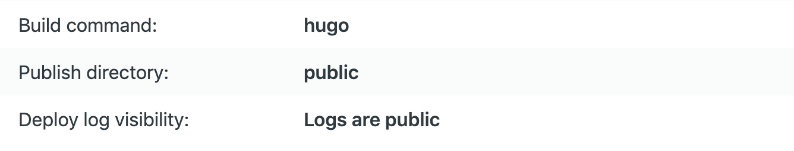

```{r setup, include=FALSE}
knitr::opts_chunk$set(echo = FALSE)
```

## Hello World!

- https://barug2019.netlify.com/
- GitHub repo: https://github.com/happyrabbit/BARUG201904
- Have a GitHub/GitLab/BitBucket account
   - Create a new repo `HelloBlogdown` and `git clone` 
   - Create a R project (`.Rproj`) and point the path to the folder
   - `blogdown::new_site()`
   - `blogdown::serve_site()`
   - `blogdown::build_site()`
   - `blogdown::new_post("Another awesome post")`
   
## Deploy

- Link your repo to Netlify: New site from Git
- Deploy: 

<center>
{width=30%}
</center>

- General -> Change site name 

## Go under the hood

- theme: http://themes.gohugo.io (themes do not work well with blogdown: https://github.com/rstudio/blogdown/issues)
- `blogdown::new_site(theme="frjo/hugo-theme-zen")`
- `config.toml`
- `content/`
- `static/`
- `themes/`
- `layouts/`

Modified version:

- https://github.com/happyrabbit/scientistcafe.com

## Other ways to build and deploy your own website

1. `html` + `css` + `rmarkdown`: https://nerdyrabbit.netlify.com/
2. One-click solution: https://templates.netlify.com
3. Fork a template to GitHub/GitLab and link it to Netlify 
    - Jekyll: http://jekyllthemes.org
    - Hugo: https://themes.gohugo.io

## [Static Site Generators](https://www.staticgen.com/): Over 400 Choices!

Primary considerations

- Familiarity of languages & tools used
- Availability/quality of docs & resources
- Features vs complexity
- Specialization (blogs, docs, etc.)
- Speed: to develop, build, load

## How to start

- Browse the docs
- Search for tutorials and reviews
- Search for themes or starters
- Explore the files in a sample project
- Try it out!

## Jekyll

- 10 years old! Lots of users, tutorials, themes
- Originally made for blogs, but used for more
- Built with Ruby: versions can be a hassle
- Liquid templating: fairly easy to read
- Markdown content
- Configuration and data files in yaml: easy to read, but whitespace sensitive
- Builds can be slow for large sites

## Hugo

- Few years old; very active development
- Built with Go, but doesn't require Go to run
- Go template language: steeper learning curve
- Content in Markdown, plus shortcodes
- Flexible and extendable, but complex
- Docs are extensive, but can be hard to read
- Reputation for very fast builds

## Gatsby

- Few years old; venture-funded development
- Built with JavaScript (React): very popular
- React component templating: steeper learning curve unless you're familiar with JS/React
- Content in Markdown or mdx (powerful but JS-heavy)
- Lots of plugins and themes (but still code-heavy)
- Static/SPA hybrid structure is fast to load


## Join Us!

- San Francisco Netlify Meetup: https://www.meetup.com/sf-netlify/
    - How static site generators work, and why they're useful
    - How to make your own generated site
    - How to easily add more features to your website: form, login, redirect etc.

- Interested in our data science team? Contact me hui@netlify.com

   