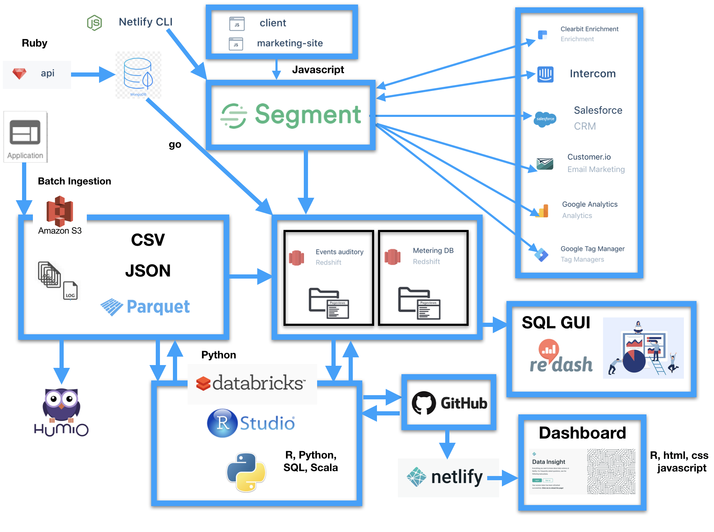

```{r setup, include=FALSE}
knitr::opts_chunk$set(echo = FALSE)
```

# Empowering data scientist/statistician with engineering education

## Why

- Industry is operating in an environment where mobile/web products and data infrastructure are becoming increasingly sophisticated

- Challenges if without being versed in certain aspects of engineering
    - Communication barrier: pipeline incidents, feature requests, authentication and data ownership
    - Inefficient processing of data, improper use of computation resources
    - Ad hoc investigation by data scientists about the meaning of data
    - Difficulty to put analysis/model to production

# Empowering data scientist/statistician with engineering education

## What

- Data system: how data is generated/stored/computed/monitored
- Data pipeline: how data flow to the database you are currently using
- Logging best practice: logging best practices and schema design
- Experimentation: experiment reporting framework to support product development
- Anomaly detection: use in-house anomaly detection framework
- Coding efficiency: create user define function in spark, coding conventions
- ML tooling

# Empowering data scientist/statistician with engineering education

## How

- Add engineering course to the curriculum
- Internal training program
- Participate in open source community

# Big Data: How big is big?

# Some Statistics

- 1 Gitabyte(GB) = 1024 Megabytes(MB) 
- 1 Petabyte(PB) = 1024 Terabytes(TB) 
- 1 Exabyte(EB) = 1024 Petabyte(PB) 
- PC holds 500 GB
- Netlify
    - 35 GB logs/day (1TB/month, 12TB/year, get to PB in 4 years)
    - 10 millions sites on our platform
- Google ([live statistics](http://www.internetlivestats.com/google-search-statistics/))
    - over 40,000 search queries/second; over 3.5 billion searches/day; 1.2 trillion searches/year(2012) 
    - 10-15 EB (data of 30 Million PCs combined!)
    - "Google currently processes over 20 petabytes of data per day through an average of 100,000 MapReduce jobs spread across its massive computing clusters."[(from a 2017 article)](https://www.heshmore.com/how-much-data-does-google-handle/)
 
# Move to the Cloud

- Amazon AWS cloud environment
- Microsoft Azure cloud environment
- Google cloud platform

<center>

</center>

# Data Pipeline

<center>
{width=80%}
</center>

# Data Science Types v.s Needs


# Hadoop/MapReduce/Spark

<center>
{width=80%}
</center>
